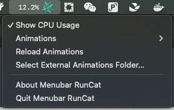

# MenuBar RunCat

由这个开源项目分支而来：
[menubar-runcat](https://github.com/inorganben/menubar_runcat)

# 新增功能
从 `~/.menubar_runcat` 目录中读取配置，可以自定义 贴图

# GifConverter
可以选择GIF转为此应用能识别的格式的小脚本
原本只做了flet版，但是我的x86Mac运行不了，MacMini可以，于是又做了一个Tkinter的

# Tags

`Swift` `Cat` `menubar`

# Demo

